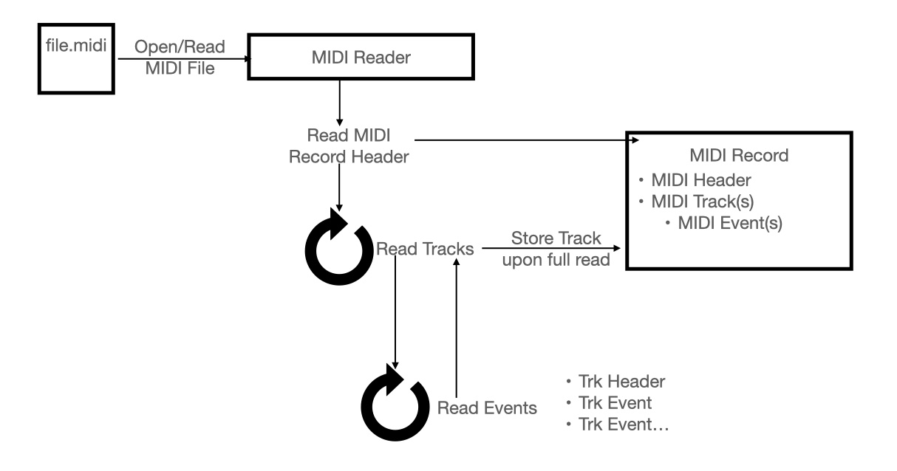

# Midi-Parser: Swift
This is the source for a Swift MIDI v1.0 reader.

Within this project, I wanted to put something together which would serve mobile developers looking for a solution to begin parsing MIDI.

There is a lot of formal documation available, with relatively little formalized examples.

## General Architecture

## Resources which helped me:
- [youtube: Programming MIDI](https://youtu.be/040BKtnDdg0)
- [C++ Example from above video](https://github.com/binexc/olcPixelGameEngine/blob/master/Videos/OneLoneCoder_PGE_MIDI.cpp)
- [Spec. w/Explanation](https://midimusic.github.io/tech/midispec.html)
- [Official MIDI Specs](https://midi.org/)

